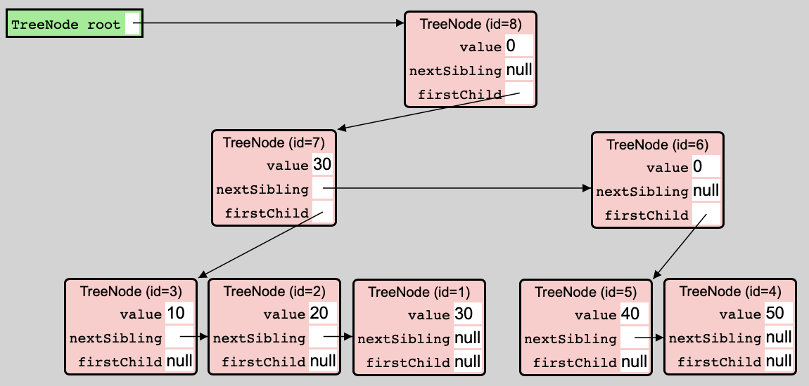

# JLearner Exercises

For each exercise, write some `assert` statements that check that your solution works correctly. For example:
- Declarations:
  ```java
  int sum(int x, int y) { return x + y; }
  ```
- Statements:
  ```java
  assert sum(3, 4) == 7;
  assert sum(1, 2) == 3;
  ```

If you want to easily copy-paste all of your code into and out of JLearner in one step, write your statements inside a `main` method:
- Declarations:
  ```java
  int sum(int x, int y) { return x + y; }
  void main() {
    assert sum(3, 4) == 7;
    assert sum(1, 2) == 3;
  }
  ```
- Expression: `main()`

Note: all Java language constructs that you need to use for these exercises are also used in the examples that you can find via the drop-down menu at the top of the JLearner webpage, so you may want to open a second copy of JLearner in a separate window so that you can look at a relevant example while making an exercise.

Note: some later exercises build on earlier ones, so keep your solutions.

## Methods, loops

- Declare a method that computes the average (rounded toward zero) between two given integers (Note: in Java, if `x` and `y` are of type `int`, `x / y` is the quotient of `x` and `y`, rounded toward zero.)
- Declare a method that computes `x` to the power of `y`, for nonnegative `y` (iterative implementation)
- Declare a method that computes `x` to the power of `y`, for nonnegative `y` (recursive implementation)
- Declare a method that computes the square root (rounded down) of a given nonnegative integer. (Find the largest integer whose square is not greater than the given number.)

## Arrays

- Declare a method that counts the number of zeroes in a given array
- Declare a method that replaces each element in an array by its negation
- Declare a method that returns a new array whose elements are the negation of the elements of a given array

## Objects

- Declare a class `Vector` such that an object of this class can be used to store a two-dimensional vector with integer coordinates `x` and `y`. (That is, declare a class `Vector` with a field `x` and a field `y`.)
- Declare a method that returns the magnitude (also known as the Euclidian length) (rounded down) of the vector stored in a given `Vector` object. (Use the square root method you declared earlier.)
- Declare a method that returns whether the vector stored in one given `Vector` object is larger than the vector stored in another given `Vector` object. Use the size method you declared in the previous exercise.
- Declare a method that returns a new `Vector` object that stores the sum of the vectors stored in two given `Vector` objects.
- Declare a method that translates (shifts) the vector stored in a given `Vector` object by the vector stored in another given `Vector` object. It updates the first `Vector` object; it does not create a new object.

## Siblings

A person is a sibling of another person if they are either a brother or a sister of the other person. For these exercises, assume no two siblings have the same age.

- Declare a class such that an object of this class can be used to store the age and the next oldest sibling of a person. (That is, declare a class `Person` with a field `age` and a field `nextOldestSibling`.) (The next oldest sibling of a person is the oldest sibling of that person that is younger than that person.) If a person has no younger siblings, store `null` in the corresponding `nextOldestSibling` field.
- Declare a method that counts the number of younger siblings of some person, given a `Person` object corresponding to that person (iterative implementation).
- Declare a method that counts the number of younger siblings of some person, given a `Person` object corresponding to that person (recursive implementation).
- Declare a method that counts the number of adult younger siblings of a some person, given a `Person` object corresponding to that person  (iterative implementation).
- Declare a method that counts the number of adult younger siblings of a some person, given a `Person` object corresponding to that person  (recursive implementation).
- Declare a method that increments the age stored for some person, as well the ages stored for the person's younger siblings by one, given a `Person` object corresponding to that person (iterative implementation).
- Declare a method that increments the age stored for some person, as well the ages stored for the person's younger siblings by one, given a `Person` object corresponding to that person (recursive implementation).
- Declare a method that updates the `Person` object corresponding to the youngest sibling of some person _p_ to reflect the fact that a new sibling (age 0) was born, given a `Person` object corresponding to person _p_ (iterative implementation).
- Declare a method that updates the `Person` object corresponding to the youngest sibling of some person _p_ to reflect the fact that a new sibling (age 0) was born, given a `Person` object corresponding to person _p_ (recursive implementation).

## Sorting

### Checks

- Declare a method `isSorted` such that `isSorted(array)` returns `true` if and only if the values stored in `array` are stored in ascending order, i.e. for any two indices I and J, if I < J then `array[I] <= array[j]`.
- Declare a method that counts the number of occurrences of a given value in a given array.
- Declare a method that returns whether an array is a *permutation* of another array. This is the case if the arrays have the same length and for each element of the first array, the number of occurrences of that element in the first array equals the number of occurrences of that element in the second array.
- Declare a method that returns whether an array is a sorted version of another array.

### Insertion sort

- Declare a method `insert` such that `insert(array, n, v)` inserts value `v` into the sorted sequence of values stored at indices 0 (inclusive) through `n` (exclusive) of `array`, such that afterwards, the sequence of values stored at indices 0 (inclusive) through `n + 1` (exclusive) is sorted. You will need to shift the elements of the sequence that are greater than `v` one position to the right. You may assume that the given array has length `n + 1` or greater.
- Declare a method `insertionSort` such that `insertionSort(array)` replaces the sequence of values stored in `array` with a sorted version of that sequence. Hint: first use `insert` to insert the second element into the sequence at indices 0 (inclusive) through 1 (exclusive). Then use `insert` to insert the third element into the sequence at indices 0 (inclusive) through 2 (exclusive). And so on.

### Selection sort

- Declare a method `removeGreatest` such that `removeGreatest(array, n)` returns the greatest element of the sequence of values stored at indices 0 (inclusive) through `n` (exclusive) in `array`, and removes one occurrence of that element from the sequence. You will need to shift the elements that appear after the removed element to the left by one position.
- Declare a method `selectionSort` such that `selectionSort(array)` replaces the sequence of values stored in `array` with a sorted version of that sequence. Hint: first use `removeGreatest` to remove the greatest element of the sequence and then put that element in the last position. Then use `removeGreatest` to remove the greatest element of the remaining sequence and then put that element in the one-but-last position. And so on.

### Merge sort

- Declare a method `merge` such that `merge(array1, array2)` returns an array that satisfies the following properties:
  - for each value V, the number of occurrences of V in the result array equals the number of occurrences of V in `array1` plus the number of occurrences of V in `array2`
  - if `array1` and `array2` are sorted (i.e. the elements stored in the array are in stored ascending order), then the result array is sorted as well.
- Declare a method `subarray` such that `subarray(array, a, b)` returns an array of length `b - a` that contains the elements at indices `a` (inclusive) through `b` (exclusive) of `array`.
- Declare a method `mergeSort` such that `mergeSort(array)` returns a new array that stores the sequence of values obtained by sorting the sequence of values stored in `array`. Hint: if the length of the array is 0 or 1, just return a copy of the array. Otherwise, use `subarray` to get the two halves of `array`, sort them using a recursive call of `mergeSort`, and then merge them using `merge`.

### Heap sort

In computer science, a *tree* consists of a number of *nodes*. Each node has zero or more *children*, which are themselves nodes. Each node is a child of at most one other node, which is called its *parent*. Exactly one node has no parent; this node is called the *root node* of the tree. We say the tree is *rooted* in that node.

A *binary tree* is a tree where each node has at most two children.

We can interpret an array as a binary tree as follows:
- Each array element is a node.
- The element at index 0 is the root node.
- The parent node of the element at index N + 1 is the element at index N/2.
This means that the children of the root node are at indices 1 and 2, the children of the node at index 1 are at indices 3 and 4, the children of the node at index 2 are at indices 5 and 6, the children of the node at index 3 are at indices 7 and 8, etc.

We say a tree is a *max-heap* if the value of a node is not less than the values of its children. In a max-heap, the value of the root node is the maximum value of all nodes of the tree.

Given a max-heap with N nodes in an array of length N + 1 or greater, we can add an element to the heap by first putting it at index N, i.e., by adding it as a child of the node at index (N-1)/2. Notice that this may break the max-heap property: the new value might be greater than its parent's value. If so, we swap the two values. But then, if the parent node is not the root node, the max-heap property may still be broken because the parent node's value might be greater than its own parent node's value. So we apply this *sift up* operation recursively to fully restore the max-heap property.
- Declare a method `heapAdd(array, n)` that adds the element at index `n` to the heap at indices 0 (inclusive) through `n` (exclusive), using the sift up algorithm.

Given a max-heap with N nodes, we can remove the root element by replacing it with the value of the leaf node at index N-1. At this point, the max-heap property may be broken because the new root value might be less than the value of one (or both) of the root node's children. In that case, we swap the root node's value with that of the child with the greatest value. But then, if this child has children of its own, the max-heap property may still be broken since this child's value may now be less than that of one (or both) of its own children. Therefore, we recursively apply this *sift down* operation to the child.
- Declare a method `heapRemove(array, n)` that removes the root element (i.e. the greatest element) of the heap at indices 0 (inclusive) through `n` (exclusive) and returns its value.

We can turn an array into a max-heap (known as *heapification*) as follows:
- Notice, first, that the heap consisting only of the node at index 0 is automatically a max-heap.
- We can add each next element of the array to the heap using the `heapAdd` method defined above.

We can sort an array by first heapifying it and then repeatedly removing the greatest element and putting it in the space freed.
- Declare a method `heapSort` such that `heapSort(array)` sorts `array` using this *heap sort* algorithm.

## Search tree

A search tree is an *ordered* tree: the order of the children of a given node is important. Specifically, in a search tree, if child A is before child B, then the values stored in the subtree rooted at child A are less than the values stored in the subtree rooted at child B.

- Declare a class `TreeNode` that represents a node in a search tree. Each node stores a reference to its first child node (or `null` if it has no children), its next sibling node (or `null` if it has no further siblings), and its value. The *children* of a node are the first child and the first child's siblings.
- Declare a method that counts the number of children of a given node.
- Declare a method that returns an array containing the sequence of children of a given node.
- A node is called a *leaf* if it has no children. Declare a method that counts the number of descendants of a given node that are leaves. (Hint: use recursion.)
- Declare a method `addLeafValues(node, array, i)` that writes the values of the descendants of `node` that are leaves into `array` starting at index `i` and returns the number of values written. (Hint: use recursion.)
- Declare a method that returns an array containing the values of the descendants of a given node that are leaves. One can think of the tree rooted in the given node as storing this set of values.
- Declare a method that checks that the values of all descendants of a given node that are leaves are less than or equal to a given value.
- Declare a method that checks that for each descendant D of a given node that has a next sibling, the values of the descendants of D that are leaves are less than or equal to the value of D. In this case, we say the tree is *valid*. We say a node is an *interior node* if it is not a leaf. The value of an interior node that has a next sibling serves as an *upper bound* on the values stored by the tree rooted in that node. (The value of an interior node that does not have a next sibling has no meaning.)
- A sequence of trees is called a *forest*. The sequence of the children of a given node is, in particular, a forest. Declare a method that returns whether a given value is the value of a leaf in the forest rooted at a given node. Use the values of the interior nodes for performance. Specifically:
  - If the given node is a null reference, return `false`.
  - If the given node is a leaf:
    - If the given value is less than the node's value, return `false`.
    - If the given value equals the node's value, return `true`.
    - If the given value is greater than the node's value, recursively check the node's next sibling.
  - If the given node is not a leaf:
    - If the given node does not have a next sibling or the given value is not greater than the node's value, recursively check the node's first child.
    - If the given node has a next sibling and the given value is greater than the node's value, recursively check the node's next sibling.
- Declare a method that adds a given value to the forest rooted in a given node and returns the new root node. Specifically:
  - If the given node is a null reference (i.e. we are adding a value to an empty forest), create a new leaf node whose value is the given value and return it.
  - If the given node is a leaf:
    - If the given value is less than the node's value, create a new node with the given value as its value and the given node as its next sibling, and return the new node.
    - If the given value equals the node's value, simply return the given node. (The tree already contains the value, so no modifications are required.)
    - If the given value is greater than the node's value, recursively add the given value to the given node's next sibling, set the given node's next sibling reference to the return value, and return the given node.
  - If the given node is not a leaf:
    - If the given node does not have a next sibling or the given value is not greater than the node's value, recursively add the given value to the given node's first child, set the given node's first child reference to the return value, and return the given node.
    - If the given node has a next sibling and the given value is greater than the node's value, recursively add the given value to the given node's next sibling, set the given node's next sibling reference to the return value, and return the given node.
- Declare a method that removes a given value from the forest rooted in a given node and returns the new root node.

#### Example



Consider the example tree shown above. The node id=8 has two children: id=7 and id=6. Node id=7 itself has three children: id=3, id=2, and id=1. Node id=6 has two children: id=5 and id=4. All nodes besides id=8 are descendants of id=8. The leaf nodes are id=3, id=2, id=1, id=5, and id=4. The interior nodes are id=8, id=7, and id=6.

This tree is a search tree: the values 10, 20, 30 stored in the subtree rooted at id=7 are less than the values 40, 50 stored in the subtree rooted at id=6. The search tree is valid: the value 30 of interior node id=7 is an upper bound for the values 10, 20, 30 stored by the subtree rooted in that node. The values of interior nodes id=8 and id=6 have no meaning because they have no next sibling.

### Balanced search tree

- Declare a method that returns the maximum of the two given numbers.
- Declare a method that returns the height of the forest rooted in a given node. The height of a null pointer is zero. The height of a node is the maximum of one more than the height of the forest rooted in its first child and the height of its next sibling.
- Declare a method that returns whether a given forest is perfectly balanced. This is the case when each tree has the same height, and furthermore each tree's sequence of children is itself perfectly balanced.
- Declare a method that returns whether a given forest is *two-three*; this means that each interior node has either two or three children. An interior node with less than two children is called *light*, and a node with more than three children is called *heavy*.
- Declare a method that adds a given value to the forest rooted in a given node, while ensuring that if the forest was two-three before, it will again be two-three afterwards. Specifically, if after the operation, a tree has four children, replace it with two trees of two children. (Notice that this method does not change the height of the forest.)
- Declare a method that adds a given value to the forest rooted in a given node, while ensuring that if the forest was two-three and had at most three trees before, it will again be two-three and have at most three trees afterwards. Specifically, if the forest has four trees, combine the trees to create two higher trees. (Notice that this operation may change the height of the forest.)
- Declare a method that removes a given value from the forest rooted in a given node, while ensuring that if the forest was two-three before, it will again be two-three afterwards. Specifically, if after the operation, a tree has only one child, merge it with a sibling to obtain either two trees of two children (if the sibling had three children) or one tree with three children (if the sibling had two children). (Notice that this operation does not change the height of the forest.)
- Declare a method that removes a given value from the forest rooted in a given node, while ensuring that if the forest was two-three before, it will again be two-three afterwards and furthermore, if it has only one tree, that tree is a leaf. Specifically, if after the operation, there is only one tree, replace it with its children. (Notice that this operation may change the height of the forest.)

The example tree shown above is perfectly balanced and two-three.

Notice that if a forest is two-three and has at most three trees, then checking whether the forest has a leaf with a given value, adding a given value, and removing a given value take time proportional to the height of the forest in the worst case. Furthermore, if the forest is perfectly balanced as well, the number of leaves in the forest is at least 2^(H-1) (rounded down), where H is the height of the forest, or, in other words, the height of the forest is at most the 2-logarithm of the number of leaves plus 1. That means that the lookup, add, and remove operations take time logarithmic in the number of leaves.
