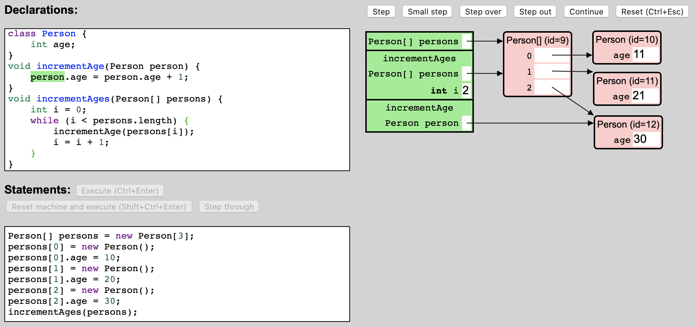

# The JLearner Programming Language

JLearner is a small subset of Java. It includes enough features of Java to be
able to serve as a vehicle for conveying the essential principles of
programming in Java, while remaining small enough to be able to be presented
fully to students taking a second programming course.

## Values and Types

The result of evaluating a JLearner expression is a *JLearner value*. The JLearner values are:
- the *Boolean values*, `true` and `false`
- the *integer values*, the integers between -2147483648 and 2147483647
- the *null reference*, `null`
- the *object references*, which uniquely identify an *object* in the *heap*

An *object* is either a *class instance* or an *array*.

The JLearner *types* are:
- type `boolean`
- type `int`
- for every class named `ClassName` declared by the JLearner program, the *class type* `ClassName`
- for every type `T`, the *array type* `T[]`. The type `T` is called the *element type* of array type `T[]`.

The values of type `boolean` are the Boolean values.

The values of type `int` are the integer values.

The values of a class type `C` are the null reference and the object references that refer to an instance of class `C`.

The values of an array type `T[]` are the null reference and the object references that refer to an array with element type `T`.

The class types and the array types are collectively called the *reference types*. Notice that the null reference is a value of every reference type.

## Classes

JLearner *class declarations* are of the form `class ClassName { FieldDeclarations }`, where `FieldDeclarations` is a sequence of zero or more *field declarations*. A JLearner field declaration is of the form `Type FieldName;`.

## The Heap

The JLearner *heap* at each point during the execution of a program contains
the objects created by the program so far. For each instance O of a class C
created by the program and for each field F of C, it stores the value of O.F.
For each array A created by the program, it stores the element type and the
length N of the array, and for each of the elements of the array (identified by
an index I between 0, inclusive, and N, exclusive), it stores the value of
A[I].

For example, consider the following snapshot from an execution of an example program in the JLearner environment:

</img>

In this snapshot (showing a particular *program execution state*), the heap contains four objects: one array, with element type `Person` and length 3, and three instances of class `Person`. The first element of the array stores a reference to a `Person` instance whose `age` field currently stores the value 11. The second element stores a reference to another `Person` instance, whose `age` field currently stores the value `21`.

The JLearner heap is always *well-typed*:
- for any instance O of a class C and for any field F of C, the value of O.F is a value of the declared type of F
- for any array A with element type T, the value of any element A[I] of A is a value of type T

## Methods

The JLearner *methods* are of the form `ReturnType MethodName(ParameterDeclarations) { Statements }` where `ReturnType` is either `void` or a type, and `ParameterDeclarations` is a comma-separated sequence of zero or more parameter declarations of the form `Type ParameterName`.

## The Method Activation Stack

Evaluation of JLearner expressions and execution of JLearner statements occurs in the context of a *variable environment* that *binds* the method parameters and local variables that are currently *in scope* to a JLearner value. The variable environment is used to evaluate variable expressions.

A method call suspends the current method activation and starts a new method activation. It pushes a corresponding *activation record* onto the *method activation stack*, also known as the *call stack*. The call stack contains an activation record for each method activation that is in progress. (At any point during the execution of a program, only one method activation, the one at the top of the activation stack, is active; the other method activations are suspended.)

For each activation, the corresponding activation record stores the current variable environment and the *program counter* (also known as the *instruction pointer*), which indicates which part of the body of the method being executed will be executed next.

When a method activation is finished, the corresponding activation record is removed (or *popped*) from the activation stack, and execution of the caller is resumed.

</img>

Consider again the same execution snapshot shown earlier (repeated here). The method activation stack currently contains three activation records. The record at the top of the stack (shown at the bottom in the picture; it is customary in computer science that stacks are depicted upside-down) corresponds to an activation of method `incrementAge`. This is the method that is currently active. When this activation is finished, the suspended activation of method `incrementAges` is resumed. The activation record for `incrementAge` binds method parameter `person` to a reference to the `Person` object with identification number 12. The activation record for `incrementAges` binds method parameter `persons` to a reference to the array object, and local variable `i` to the integer value 2.

The method activation stack is always well-typed: if an activation record binds a method parameter or local variable of declared type T to a value V, then value V is of type T.

## Expressions

The JLearner *expressions* are:
- the *literal expressions*, e.g. `true`, `42`, `null`
- the *operator expressions*, e.g. `3 + 5` or `x = y * 3`
- the *variable expressions*, e.g. `x` or `myVariable`
- the *object creation expressions*, e.g. `new Rectangle()` or `new int[7]`
- the *field selection expressions*, e.g. `myRectangle.width`
- the *array element selection expressions*, e.g. `myArray[5]`
- the *method call expressions*, e.g. `myMethod(42, false)`
- the *parenthesized expressions*, e.g. `(7 - 1)`

The literal expressions are:
- the *Boolean literal expressions*, `true` and `false`
- the *integer literal expressions*, e.g. `10`, `42`, `739`
- the *null literal expression*, `null`

The operator expressions are:
- the *unary operator expressions*, e.g. `-3`, `++x`, `y--`, `-myMethod(77)`
- the *binary operator expressions*, e.g. `myVariable / myMethod(10)`, `myVariable = 33`

The unary operator expressions are:
- the *negation expressions*, of the form `-Expression`, i.e. a negation sign followed by an expression.
- the *pre-decrement expressions*, of the form `--Expression`
- the *pre-increment expressions*, of the form `++Expression`
- the *post-decrement expressions*, of the form `Expression--`
- the *post-increment expressions*, of the form `Expression++`

The subexpression of a unary expression, e.g. the expression `E` in negation expression `-E`, is called the *operand expression* of the unary expression.

The binary operator expressions are:
- the *addition expressions*, of the form `Expression + Expression`
- the *subtraction expressions*, of the form `Expression - Expression`
- the *multiplication expressions*, of the form `Expression * Expression`
- the *division expressions*, of the form `Expression / Expression`
- the *remainder expressions*, of the form `Expression % Expression`
- the *equality expressions*, of the form `Expression == Expression`
- the *inequality expressions*, of the form `Expression != Expression`
- the *less-than expressions*, of the form `Expression < Expression`
- the *less-than-or-equals expressions*, of the form `Expression <= Expression`
- the *greater-than expressions*, of the form `Expression > Expression`
- the *greater-than-or-equals expressions*, of the form `Expression >= Expression`
- the *conjunction expressions*, of the form `Expression && Expression`
- the *disjunction expressions*, of the form `Expression || Expression`
- the *assignment expressions*, of the form `Expression = Expression`
- the *compound assignment expressions*, of the form `Expression op= Expression`, where `op` is one of `+`, `-`, `*`, `/`, `%`. For example: `x += 3` or `y *= 5`

The subexpressions of a binary operator expression, e.g. the expressions `E1` and `E2` in addition expression `E1 + E2`, are called the *left operand expression* (or *left-hand side*, abbreviated LHS) and the *right operand expression* (or *right-hand side*, abbreviated RHS) of the binary operator expression, respectively.

The variable expressions are the expressions of the form `VariableName`.

The object creation expressions are:
- the *class instance creation expressions*, of the form `new ClassName()`
- the *array creation expressions*, of the form `new Type[Expression]`

The field selection expressions are the expressions of the form `Expression.FieldName`.

The array element selection expressions are the expressions of the form `Expression[Expression]`.

The method call expressions are the expressions of the form `MethodName(Expressions)`, where `Expressions` (known as the *argument expressions* of the method call expression) is a comma-separated sequence of zero or more expressions.

The parenthesized expressions are the expressions of the form `(Expression)`.

### Precedence and associativity

The expression `1 + 2 * 3` is an addition expression whose right operand is a multiplication expression; it is not a multiplication expression whose left operand is an addition expression. This is because the multiplication operator has *higher precedence* than the addition operator.

Furthermore, `1 - 2 - 3` is a subtraction expression whose left operand is a subtraction expression; it is not a subtraction expression whose right operand is a subtraction expression. This is because the negation operator is *left-associative*.

The following table lists the operators in order of decreasing precedence.

| Operators | Associativity |
| --- | --- |
| Unary (`-`, `++`, `--`) | |
| `*` `/` `%` | Left |
| `+` `-` | Left |
| `==` `!=` `<` `<=` `>` `>=` | |
| `&&` | |
| `\|\|` | |
| `=` `op=` | Right |

## Statements

The JLearner *statements* are:
- the *local variable declaration statements*, of the form `Type VariableName = Expression;` or `Type VariableName = ArrayInitializer;`, where `ArrayInitializer` is of the form `{ Expressions }`, where `Expressions` is a comma-separated sequence of zero or more expressions
- the *expression statements*, of the form `Expression;`
- the *if statements*, of the form `if (Expression) Statement` or `if (Expression) Statement else Statement`
- the *while statements*, of the form `while (Expression) Statement`
- the *for statements*, of the form `for (Initialization; Condition; Update) Statement`, where `Initialization` is either nothing or of the form `Type VariableName = Expression` or of the form `VariableName = Expression`, `Condition` is either nothing or an expression, and `Update` is either nothing or an expression
- the *block statements*, of the form `{ Statements }`, where `Statements` is a sequence of zero or more statements
- the *return statements*, of the form `return;` or `return Expression;`
- the *assert statements*, of the form `assert Expression;`
