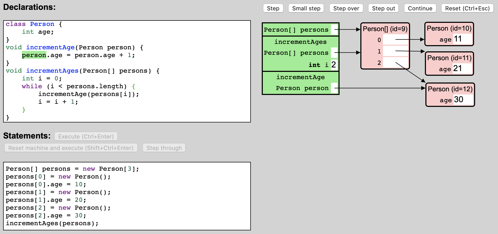
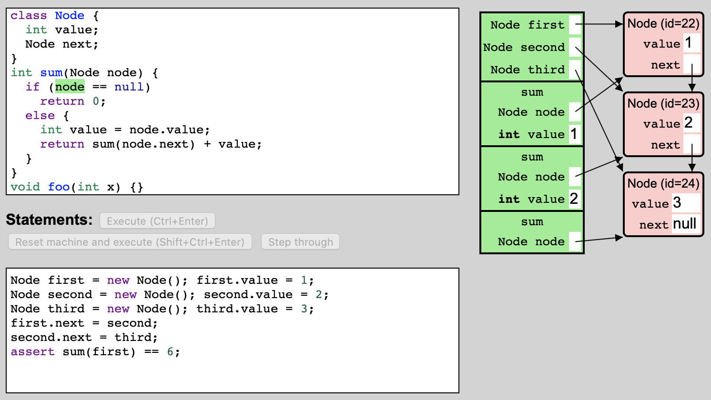

# The JLearner Programming Language

[JLearner](https://btj.github.io/jlearner) is a browser-hosted environment to be used by students of Java for experimenting with and stepping through simple Java programs. The programming language supported by JLearner, called the JLearner programming language or simply JLearner in this document, is a small subset of Java. It includes enough features of Java to be
able to serve as a vehicle for conveying the essential principles of
programming in Java, while remaining small enough to be able to be presented
fully to students taking a second programming course.

In this document, we define the syntax of JLearner programs and what it means to execute them. We assume that the reader recognizes these concepts from their introductory programming course;
this document serves to further clarify these concepts and to offer a reasonably precise vocabulary for discussing and reasoning about JLearner (and Java) programs and their execution.

To further clarify the details of program execution, we recommend that students step through example programs in the JLearner environment while studying this document.

Contents:
- [Values and Types](#values-and-types)
- [Classes](#classes)
- [The Heap](#the-heap)
- [Methods](#methods)
- [The Method Activation Stack](#the-method-activation-stack)
- [Variables and Variable Declarations](#variables-and-variable-declarations)
- [Expressions](#expressions)
- [Statements](#statements)
- [Further Reading](#further-reading)

## Values and Types

The result of evaluating a JLearner expression is a *JLearner value*. The JLearner values are:
- the *Boolean values*, `true` and `false`
- the *integer values*, the integers between -2147483648 and 2147483647
- the *null reference*, `null`
- the *object references*, which uniquely identify an *object* in the *heap*

An *object* is either a *class instance* or an *array*.

The JLearner *types* are:
- type `boolean`
- type `int`
- for every class named `ClassName` declared by the JLearner program, the *class type* `ClassName`
- for every type `T`, the *array type* `T[]`. The type `T` is called the *element type* of array type `T[]`.

The values of type `boolean` are the Boolean values.

The values of type `int` are the integer values.

The values of a class type `C` are the null reference and the object references that refer to an instance of class `C`.

The values of an array type `T[]` are the null reference and the object references that refer to an array with element type `T`.

The class types and the array types are collectively called the *reference types*. Notice that the null reference is a value of every reference type.

## Classes

JLearner *class declarations* are of the form `class ClassName { FieldDeclarations }`, where `FieldDeclarations` is a sequence of zero or more *field declarations*. A JLearner field declaration is of the form `Type FieldName;`.

## The Heap

The JLearner *heap* at each point during the execution of a program contains
the objects created by the program so far. For each instance O of a class C
created by the program and for each field F of C, it stores the value of O.F. (We also say that it *binds* O.F to some value.)
For each array A created by the program, it stores the element type and the
length N of the array, and for each of the *components* of the array (identified by
an index I between 0, inclusive, and N, exclusive), it stores the value of
A[I]. (We also say that it *binds* A[I] to some value.) We often refer to the values stored by the components of an array as the array's *elements*.

For example, consider the following snapshot from an execution of an example program in the JLearner environment:

</img>

In this snapshot (showing a particular *program execution state*), the heap contains four objects: one array, with element type `Person` and length 3, and three instances of class `Person`. The first component of the array stores a reference to a `Person` instance whose `age` field currently stores the value 11. The second component stores a reference to another `Person` instance, whose `age` field currently stores the value `21`.

The JLearner heap is always *well-typed*:
- for any instance O of a class C and for any field F of C, the value of O.F is a value of the declared type of F
- for any array A with element type T, the value of any component A[I] of A is a value of type T

## Methods

The JLearner *methods* are of the form `ReturnType MethodName(ParameterDeclarations) { Statements }` where `ReturnType` is either `void` or a type, and `ParameterDeclarations` is a comma-separated sequence of zero or more parameter declarations of the form `Type ParameterName`.

## The Method Activation Stack

Evaluation of JLearner expressions and execution of JLearner statements occurs in the context of a *variable environment* that *binds* the method parameters and local variables that are currently *in scope* to a JLearner value. The variable environment is used to evaluate variable expressions.

A method call suspends the current method activation and starts a new method activation. It pushes a corresponding *activation record* onto the *method activation stack*, also known as the *call stack*. The call stack contains an activation record for each method activation that is in progress. (At any point during the execution of a program, only one method activation, the one at the top of the activation stack, is active; the other method activations are suspended.)

For each activation, the corresponding activation record stores the current variable environment and the *program counter* (also known as the *instruction pointer*), which indicates which part of the body of the method being executed will be executed next. (JLearner shows the instruction pointer of the active activation by highlighting the program element in green; it does not show the instruction pointers of the suspended activations.)

When a method activation is finished, the corresponding activation record is removed (or *popped*) from the activation stack, and execution of the caller is resumed.

</img>

Consider again the same execution snapshot shown earlier (repeated here). The method activation stack currently contains three activation records. The record at the top of the stack (shown at the bottom in the picture; it is customary in computer science that stacks are depicted upside-down) corresponds to an activation of method `incrementAge`. This is the method that is currently active. When this activation is finished, the suspended activation of method `incrementAges` is resumed. The activation record for `incrementAge` binds method parameter `person` to a reference to the `Person` object with identification number 12. The activation record for `incrementAges` binds method parameter `persons` to a reference to the array object, and local variable `i` to the integer value 2.

The method activation stack is always well-typed: if an activation record binds a method parameter or local variable of declared type T to a value V, then value V is of type T.

## Variables and Variable Declarations

JLearner has four kinds of *variables*: object fields, array components, method parameters, and local variables. Variables are created at some point during a program execution and, from that point on,
store a value. They can be mutated to store a different value by means of assignments.

Variable *declarations*, on the other hand, are parts of the program text and exist independently of any execution of the program. JLearner has three kinds of variable declarations: field declarations, method parameter declarations, and local variable declarations.

At any point during an execution of a program, a single variable declaration may correspond to zero, one, or many variables:
- for each field declaration of a class C, there is one object field in the heap per instance of class C
- for each method parameter declaration of a method M, there is one method parameter on the method activation stack for each currently active or suspended activation of method M
- similarly, for each local variable declaration in a method M, there is one local variable on the method activation stack for each currently active or suspended activation of method M whose instruction pointer is within the scope of the local variable declaration

For array components, there is no corresponding declaration.

Consider the following snapshot from an execution in the JLearner environment of an example program that uses a recursive method `sum` to compute the sum of the values stored by a linked list:

</img>

- for the single field declaration `int value` of class `Node`, there are three corresponding object fields, one in each of the three instances of `Node`
- for the single method parameter declaration `Node node` of method `sum`, there are three corresponding method parameters, one in each of the three currently active or suspended activations of method `sum`
- for the single local variable declaration `int value` in method `sum`, there are two corresponding local variables, one in each of the two currently suspended activations of method `sum`. (There is no corresponding local variable in the active activation of method `sum` because its instruction pointer is not in the scope of the local variable declaration.)
- for the method parameter declaration `int x` of method `foo`, there are no corresponding method parameters on the method activation stack, because there is no current activation of method `foo`.

## Expressions

An expression is a part of a program that can be *evaluated* in a given *variable environment* to produce a *result value*. Evaluation of an expression may also produce *side effects*. In JLearner, the side effects are the object creations and the variable mutations. That is, in addition to producing a result value, evaluation of an expression may create objects, bind different values to object fields and array components in the heap, and bind different values to method parameters and local variables in the active method activation record.

Some expressions can be evaluated to a *variable*: field selection expressions can be evaluated to an object field, array component selection expressions can be evaluated to an array component, and variable expressions can be evaluated to a method parameter or local variable. These are the expressions that can be used as the left-hand side of an assignment expression. To evaluate these expressions to produce a value, they are first evaluated to a variable, and then the variable is inspected to obtain its current value.

The JLearner *expressions* are:
- the *literal expressions*, e.g. `true`, `42`, `null`
- the *operator expressions*, e.g. `3 + 5` or `x = y * 3`
- the *variable expressions*, e.g. `x` or `myVariable`
- the *object creation expressions*, e.g. `new Rectangle()` or `new int[7]`
- the *field selection expressions*, e.g. `myRectangle.width`
- the *array component selection expressions*, e.g. `myArray[5]`
- the *method call expressions*, e.g. `myMethod(42, false)`
- the *parenthesized expressions*, e.g. `(7 - 1)`

### Literal expressions

The literal expressions are:
- the *Boolean literal expressions*, `true` and `false`
- the *integer literal expressions*, e.g. `10`, `42`, `739`
- the *null literal expression*, `null`

Evaluation of a literal expression has no side-effects and produces as a result value the value denoted by the expression.

### Operator expressions

The operator expressions are:
- the *unary operator expressions*, e.g. `-3`, `++x`, `y--`, `-myMethod(77)`
- the *binary operator expressions*, e.g. `myVariable / myMethod(10)`, `myVariable = 33`

The unary operator expressions are:
- the *negation expressions*, of the form `-Expression`, i.e. a negation sign followed by an expression.
- the *pre-increment expressions*, of the form `++Expression`
- the *pre-decrement expressions*, of the form `--Expression`
- the *post-increment expressions*, of the form `Expression++`
- the *post-decrement expressions*, of the form `Expression--`

The subexpression of a unary expression, e.g. the expression `E` in negation expression `-E`, is called the *operand expression* of the unary expression.

Evaluation of a negation expression first evaluates its operand expression. If this yields a value V, evaluation of the negation expression completes with result -V.

Evaluation of a pre-increment expression first evaluates its operand expression to a variable Var. Then, it looks up Var's current value V. Then, it mutates Var to store value V + 1. Then, evaluation completes with result value V + 1.

In contrast, evaluation of a post-increment expression first evaluates its operand expression to a variable Var. Then, it looks up Var's current value V. Then, it mutates Var to store value V + 1. Then, evaluation completes with result value V (not V + 1).

Evaluation of a pre-decrement or post-decrement expression proceeds analogously.

The binary operator expressions are:
- the *addition expressions*, of the form `Expression + Expression`
- the *subtraction expressions*, of the form `Expression - Expression`
- the *multiplication expressions*, of the form `Expression * Expression`
- the *division expressions*, of the form `Expression / Expression`
- the *remainder expressions*, of the form `Expression % Expression`
- the *equality expressions*, of the form `Expression == Expression`
- the *inequality expressions*, of the form `Expression != Expression`
- the *less-than expressions*, of the form `Expression < Expression`
- the *less-than-or-equals expressions*, of the form `Expression <= Expression`
- the *greater-than expressions*, of the form `Expression > Expression`
- the *greater-than-or-equals expressions*, of the form `Expression >= Expression`
- the *conjunction expressions*, of the form `Expression && Expression`
- the *disjunction expressions*, of the form `Expression || Expression`
- the *assignment expressions*, of the form `Expression = Expression`
- the *compound assignment expressions*, of the form `Expression op= Expression`, where `op` is one of `+`, `-`, `*`, `/`, `%`. For example: `x += 3` or `y *= 5`

The subexpressions of a binary operator expression, e.g. the expressions `E1` and `E2` in addition expression `E1 + E2`, are called the *left operand expression* (or *left-hand side*, abbreviated LHS) and the *right operand expression* (or *right-hand side*, abbreviated RHS) of the binary operator expression, respectively.

Evaluation of a binary operator expression `E1 op E2`, where `op` is `+`, `-`, `*`, `/`, `%`, `==`, `!=`, `<`, `<=`, `>`, or `>=`, first evaluates E1 to a value V1, then evaluates E2 to a value V2, and then completes with the result value obtained by applying operator `op` to V1 and V2.

Evaluation of a conjunction expression `E1 && E2` first evaluates E1 to a Boolean value V1. If V1 is `false`, evaluation completes with result value `false`. Otherwise, E2 is evaluated to a value V2 and evaluation completes with result value V2.

Analogously, evaluation of a disjunction expression `E1 || E2` first evaluates E1 to a Boolean value V1. If V1 is `true`, evaluation completes with result value `true`. Otherwise, E2 is evaluated to a value V2 and evaluation completes with result value V2.

Evaluation of an assignment expression `E1 = E2` first evaluates E1 to a variable Var, then evaluates E2 to a value V, then mutates Var to store V, and then completes with result value V.

Evaluation of a compound assignment expression `E1 op= E2` first evaluates E1 to a variable Var, then looks up the value V1 of Var, then evaluates E2 to value V2, then computes the result V of applying `op` to V1 and V2, then mutates Var to store V, and then completes with value V.

### Other expressions
The variable expressions are the method parameter names and the local variable names.

Evaluation of a variable expression to a variable yields the variable of the given name in the active activation record's variable environment.

The object creation expressions are:
- the *class instance creation expressions*, of the form `new ClassName()`
- the *array creation expressions*, of the form `new Type[Expression]`

Evaluation of a class instance creation expression `new C()` creates a new instance O of class C in the heap, then for each field F declared by C initializes object field O.F with the default value of the declared type of F, and then completes with a reference to O as the result value. The default value of type `boolean` is `false`, the default value of type `int` is 0, and the default value of a reference type is `null`.

Evaluation of an array creation expression `new T[E]` first evaluates E to a value V (which must be a nonnegative integer), then creates a new array A with element type T and length V in the heap, then initializes each component of the array with the default value of type T, and then completes with a reference to A as the result value.

The field selection expressions are the expressions of the form `Expression.FieldName`.

Evaluation of a field selection expression `E.F` to a variable first evaluates the *target expression* E to a value V (which must be a reference O to an instance of a class C that declares a field named F), and then completes with variable O.F as its result.

However, an expression `E.length`, where `E` is of an array type, is an *array length expression*. It is evaluated by first evaluating E to a value V, which must be a reference to an array A. It then completes with result value N, where N is the length of A.

The array component selection expressions are the expressions of the form `Expression[Expression]`.

Evaluation of an array component selection expression `E1[E2]` first evaluates the *target expression* E1 to a value V1 (which must be a reference to an array A), then evaluates the *index expression* E2 to a value V2 (which must be a valid index I for array A), and then completes with variable A[I] as its result.

The method call expressions are the expressions of the form `MethodName(Expressions)`, where `Expressions` (known as the *argument expressions* of the method call expression) is a comma-separated sequence of zero or more expressions.

Evaluation of a method call expression `M(Expressions)` first evaluates the argument expressions `Expressions`, from left to right, to obtain *argument values* `Args`. It must be the case that the number of arguments equals the number of declared parameters of method M. Then, a new activation record is pushed onto the method activation stack, and for each method parameter declaration P of method M, a method parameter P is added to the new activation record's variable environment, initialized with the corresponding argument value. The new activation record's instruction pointer is initialized to point to the first statement of the body of method M. Program execution then proceeds by executing the body of M. When the new activation finishes with a result value V, its activation record is removed from the activation stack and evaluation of the method call expression completes with value V.

The parenthesized expressions are the expressions of the form `(Expression)`.

Evaluation of a parenthesized expression `(E)` first evaluates E to a value V, and then completes with value V.

### Precedence and associativity

The expression `1 + 2 * 3` is an addition expression whose right operand is a multiplication expression; it is not a multiplication expression whose left operand is an addition expression. This is because the multiplication operator has *higher precedence* than the addition operator.

Furthermore, `1 - 2 - 3` is a subtraction expression whose left operand is a subtraction expression; it is not a subtraction expression whose right operand is a subtraction expression. This is because the negation operator is *left-associative*.

The following table lists the operators in order of decreasing precedence.

| Operators | Associativity |
| --- | --- |
| Unary (`-`, `++`, `--`) | |
| `*` `/` `%` | Left |
| `+` `-` | Left |
| `==` `!=` `<` `<=` `>` `>=` | |
| `&&` | |
| `\|\|` | |
| `=` `op=` | Right |

## Statements

The JLearner *statements* are:
- the *local variable declaration statements*, of the form `Type VariableName = Expression;` or `Type[] VariableName = ArrayInitializer;`, where `ArrayInitializer` is of the form `{ Expressions }`, where `Expressions` is a comma-separated sequence of zero or more expressions
- the *expression statements*, of the form `Expression;`
- the *if statements*, of the form `if (Expression) Statement` or `if (Expression) Statement else Statement`
- the *while statements*, of the form `while (Expression) Statement`
- the *for statements*, of the form `for (Initialization; Condition; Update) Statement`, where `Initialization` is either nothing or of the form `Type VariableName = Expression` or of the form `VariableName = Expression`, `Condition` is either nothing or an expression, and `Update` is either nothing or an expression
- the *block statements*, of the form `{ Statements }`, where `Statements` is a sequence of zero or more statements
- the *return statements*, of the form `return;` or `return Expression;`
- the *assert statements*, of the form `assert Expression;`

Execution of a local variable declaration statement `T X = E;` first evaluates *initializer* E to a value V (which must be of type T), and then adds a new local variable named X to the active activation record's variable environment, initialized with V.

Execution of a local variable declaration statement `T[] X = {Expressions};` first evaluates `Expressions`, from left to right, to a sequence of values Vs, then creates a new array A in the heap with element type T and length N equal to the number of values, then initializes each component of A with the corresponding value from Vs, and then adds a new local variable named X to the active activation record's variable environment, initialized with a reference to A.

Execution of an expression statement `E;` evaluates E.

Execution of an if statement `if (E) S` first evaluates E to a Boolean value V. If V is `true`, it then executes `S`.

Execution of an if statement `if (E) S1 else S2` first evaluates E to a Boolean value V. If V is `true`, it then executes `S1`; otherwise, it then executes `S2`.

Execution of a while statement `while (E) S` first evaluates E to a Boolean value V. If V is `true`, it then executes `S` and `while (E) S`, in that order.

Execution of a for statement `for (Init; Cond; Update) S` is equivalent to execution of a block `{ Init; while (Cond) { S Update; } }`.

Execution of a block statement `{ Statements }` executes the given statements, from left to right, and then removes all local variables from the active activation record's variable environment that were added since the start of the execution of the block.

Execution of a return statement `return;` causes the active method activation to finish without a result value. Execution of a return statement `return E;` first evaluates E to a value V and then causes the active method activation to finish with result value V.

Execution of an assert statement `assert E;` evaluates E to a value, which must be the value `true`.

## Further reading

The syntax and meaning of the full Java programming language is specified in the [Java Language Specification](https://docs.oracle.com/javase/specs/index.html).
